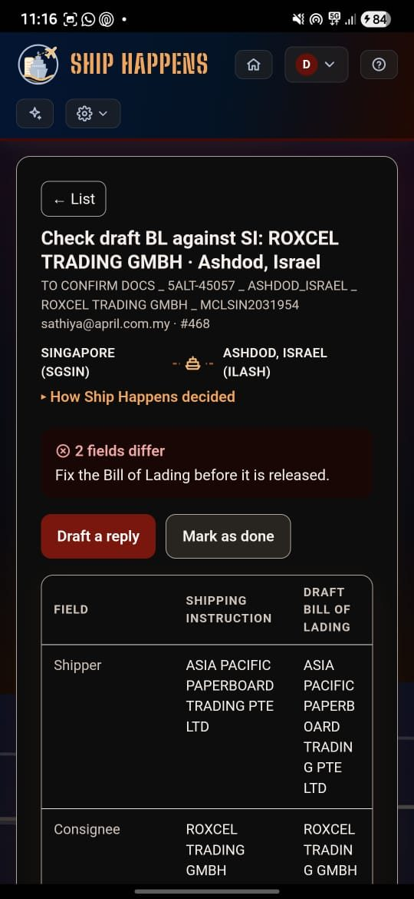
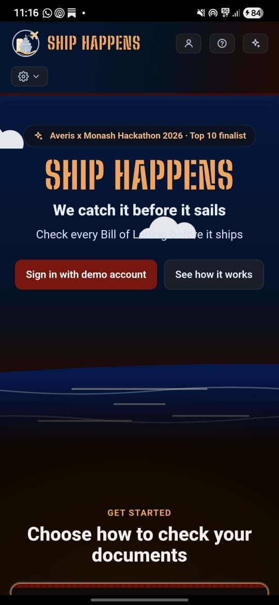

# Ship Happens: shipping document verification

**Averis x Monash Hackathon 2026, top 10 finalist.** Reads a shipping inbox,
classifies every email, and for document-comparison requests checks a draft
Bill of Lading against its Shipping Instruction, field by field, before the BL
is released.


**Contents:** [Start here](#start-here) · [What you can do](#what-you-can-do) ·
[Why it matters](#why-it-matters) · [How it works](#how-it-works) ·
[The dataset](#the-dataset-is-in-the-repo) · [Where the code lives](#where-the-code-lives) ·
[Evidence](#evidence) · [The five contracts](#the-five-contracts) ·
[Deploying it](#deploying-it) · [Who built what](#who-built-what) ·
[Roadmap](#roadmap) · [Working on this](#working-on-this) · [Documents](#documents)

## Start here

Everything below is the fastest path from "never seen this" to "it works".

### 1 · Nothing to install

| | |
|---|---|
| **Review app** | <https://codebase-ten-peach.vercel.app/> |
| **Demo video** | <https://drive.google.com/file/d/1Q_G2_Z5LWUpWRgUgYhbz7QX10cK3SfSD/view> |
| **API** | <https://blockeris-backend.onrender.com/docs> |

The app is a static page carrying its own results (all 520 emails, every
comparison already run), so it opens with no backend, no key and no network.
Only **My mailbox** (after Sign in with Google), **Upload files** and the AI
reply features call the API, which sits on a free host and can take about 100
seconds to wake. The demo data needs nothing else. A private window gives the
cleanest first look: the page remembers your language, colours, panel width and
which emails you marked as done.


One email, decided. The list is sorted by how much needs fixing; the open email
names its shipment, its route and how many of the seven fields differ.


The two fields that differ are named, each with a **Review** button, and both
source documents sit underneath. Click any row and the line it came from is
highlighted in both documents, so a person can confirm it in seconds rather than
reading two files.

#### On a phone

<p>


</p>

The review app installs to the home screen and opens without browser chrome. It
carries its own results, so once installed it works with no signal at all.

**Android, Chrome.** Open <https://codebase-ten-peach.vercel.app/>. Chrome
usually offers **Install** on its own; if it does not, use **⋮ → Add to Home
screen → Install**.

**iPhone or iPad, Safari.** Open the same link in **Safari**, then
**Share → Add to Home Screen**. iOS never prompts by itself and offers this only
from Safari, so a link opened inside another app's browser will not show it.

Two things that look like failures and are not. Chrome hides **Install** when
the app is *already installed*: uninstall the old copy first, and clear the site
data with **⋮ → Settings → Site settings → Clear & reset**, which also removes
the old cached copy. And a private or incognito window never offers to install,
so use an ordinary tab for this even though a private one is the better first
look at the page.

**An installed copy can be out of date, and it will not say so.** The service
worker fetches from the network first and only falls back to its cache, but an
installed app that is resumed rather than relaunched never navigates, so it
never asks. If what you see does not match the screenshots above, force-close
the app and reopen it. If it still differs, uninstall and clear the site data as
above. The browser at <https://codebase-ten-peach.vercel.app/> is always
current; only an installed copy can lag.

On Android the icon is baked into the wrapper Chrome generates at install time,
so it does not change in place either; the same uninstall-and-reinstall is what
picks up a new one. If Android warns that the app was *"built for an older
version of Android"*, that wrapper is Chrome's, not ours: this repository ships
no APK, and its `targetSdkVersion` is set by Google's minting service rather
than by anything in `frontend/manifest.json`.

### 2 · Get the code

Either **Download ZIP** from the green **Code** button on
<https://github.com/Blockeris-Monash/codebase>, unzip it and open the folder
(nothing in the project needs git), or:

```bash
git clone https://github.com/Blockeris-Monash/codebase.git
cd codebase
```

### 3 · Set it up

Python 3.12 (3.11 works too; CI runs both), plus `python3-venv` on Debian or
Ubuntu. No database, no API key. Node is optional: a few frontend tests run the
page's own JavaScript in it and skip without it.

**macOS and Linux**

```bash
python3 -m venv .venv
source .venv/bin/activate
pip install -r requirements.txt
python -m pytest -q          # 0 failed, 80 skipped (skips need a model key)
```

**Windows (PowerShell)**

```powershell
py -m venv .venv
.venv\Scripts\activate
pip install -r requirements.txt
python -m pytest -q          # 0 failed, 80 skipped (skips need a model key)
```

If the tests print 0 failed, you are done: that is the whole system checked
offline, with no key and no network.

The suite prints its own grouped report rather than a wall of dots, so the run
says what it proved:

| | |
|---|---|
| **Formats** | txt, Word, Excel and PDF parse; 242 of 250 read; the other 8 escalate |
| **EDI 304** | a different format reaching the same seven fields, delimiters read from the ISA rather than assumed, pounds converted, net weight not counted as gross |
| **Label alignment** | each shape of variation, CJK stripped before lookup, the `NET WEIGHT` decoy not claimed |
| **Comparison rules** | the locode decoy, counts per container size, weights (decimal commas too), suffixes; `N/A`, `TBA` and `____MT` have no value |
| **Ordering** | a blank is checked before a mismatch, so formatting is never a discrepancy |
| **Escalation wording** | the blank token is quoted rather than summarised, the wrong document names what it declares itself, a pasted address is truncated |
| **Shipment reference** | both reference shapes and neither, and that `INTERNATIONAL` is not one |
| **Classification** | the body decides, all five categories, and the evidence is true of the email |
| **Failure modes** | a missing file, an unknown format, a corrupt zip, a zip bomb and a near-empty document all escalate; 250 files, zero exceptions |
| **Cross-check** | two independent comparators reaching the same verdict on 126 emails |
| **Contracts** | every fixture against its schema, the if-and-only-if rules included, plus a regression guard on each |
| **Edge cases** | 31 emails shaped like real customer mail, each with its expected result written before it was run |
| **End to end** | eight emails, eight outcomes, and a person gets the reason |

That is a selection; the run prints every area.

The 80 skipped tests reach a model over the network and are **skipped unless you
ask for them by name**: `SHIP_HAPPENS_LIVE=1` plus the matching key. A key on
its own is not enough, deliberately: a Gemini or Qwen key left in the
environment from another project used to unskip them, fire live calls and fail,
which says nothing about this repository. `QWEN_BASE_URL` also defaults to a
proxy only our team can reach, so someone else's key would fail against
infrastructure they have no access to. They are our liveness check, not
evidence for a reader.

### 4 · Run it

Three things, each in the activated environment. **Keep it activated**: `python`
is this project's interpreter on every platform, so every block on this page is
the same whichever machine you are on.

**The review app**, the screens in the pictures above, all 520 emails:

```bash
cd frontend && python -m http.server 8099
```

Open <http://localhost:8099>. Static, so no backend and no key for the demo data.
Opened on localhost, the page calls the API on this machine at port 8000
(`frontend/config.js`), so start that too to upload files, use My mailbox or
refine a draft.

**One email through all five stages**, printed as it goes:

```bash
python -m cli.demo_pipeline email_004
```

**The API**:

```bash
python -m uvicorn backend.app:app --port 8000
```

Open <http://localhost:8000/docs>. With no key, `/health`, `/extract-clean-compare`
(from the saved extracts in `results/extracts/`), `/check-files` and `/recompare`
all work; documents with ordinary labels are read by rule, with no model call.

### The API

| Route | What it does | Needs |
|---|---|---|
| `GET /health` | Liveness, for the host's health check | nothing |
| `POST /extract-clean-compare` | SI and BL label/value pairs in, the comparison out | nothing (`?live=true` calls Qwen) |
| `POST /check-files` | An uploaded SI and draft BL, checked the same way; nothing uploaded is kept | nothing |
| `POST /recompare` | One field compared again after a reviewer fixes a reading, no model call | nothing |
| `POST /classify` | One email in, its category out | `QWEN_API_KEY` |
| `POST /process-email` | Classify, then compare or draft, one email end to end | `QWEN_API_KEY` |
| `POST /translate` | An email and its documents into English, Malay or Chinese | a model key |
| `GET /mailbox` | The signed-in person's newest Gmail, each email checked | Google sign-in |
| `POST /draft-reply` | The AI's reply to one checked mailbox email, when asked | Google sign-in, a model key |
| `POST /refine` | Rewrite a draft to an instruction such as "shorter" | a model key |
| `POST /reply` | Send the reviewer's reply from their own Gmail, in the thread | Google sign-in |

`/extract-clean-compare` takes label/value pairs, not a file: `email_id`,
`si_pairs`, `bl_pairs`, `si_title`, `bl_title` and the two parse statuses;
`cli.demo_pipeline` above builds that body for you. The mailbox routes take the
person's Google token from the browser, never a key in the environment, and
whose mailbox it is comes from Google, never from a user id the caller sends.
`/translate` has no caller in the review app, whose language switch uses a
built-in table in `frontend/i18n.js`, so it is an endpoint rather than a feature
of the page.

**The live model path.** Copy `.env.example` to `.env` and fill in
`QWEN_API_KEY` (and `QWEN_BASE_URL` for the team proxy). `GOOGLE_API_KEY` is
optional and adds Gemini as the backup behind Qwen, and as the first choice for
reply drafts. Without activating the environment, anything importing the
backend fails with `No module named 'dotenv'` (`cli.evidence`,
`cli.mutation_check`, `cli.make_results`, `cli.latency`); the rest are
stdlib-only and run on any Python 3.12.

## What you can do

Everything below works in the demo with no sign-in unless it says otherwise.

**Review the checks**
- **Folders:** Action required, Needs review, Verified, Done and Other mail.
  Other mail holds draft BL requests, SI requests, invoices, general mail and
  spam, each with a short intent label ("Check draft BL against SI", "Cancel
  invoice").
- **Search** any mail by sender, subject or shipment reference (`5ALT-01226`,
  `OOLU9284044566`); sort by most or fewest issues, newest or oldest.
- **Open an email** to see the seven-field table, the reason in plain words, and
  both original documents with the clicked row highlighted in each. Left and
  right arrow keys move between emails.
- **Review a flagged field:** *Confirm difference*, *Not a real difference*, or
  *Fix the reading* when the AI misread a document (the field is compared again
  with the same rule, no model call). The email's status and folder follow.
- **A revised draft BL** in the same email is compared against the latest
  revision, and "Since the last draft" lists what it fixed, what is still wrong
  and what it broke.
- **Scanned documents** (#512 to #514) show what a vision model read beside the
  page image, and still go to a person.
- **Mark as done**, with Undo; a progress line counts what is left.

**Act on them**
- **Draft a reply** that names what to fix. Demo emails carry replies written in
  advance; in your own mailbox the AI drafts it when you ask, says when no
  company policy stood behind it, and can **refine** it to your instruction.
- **Chase list:** in Draft BL requests, every draft BL a sender was asked for and
  has not sent yet, by sender and shipment reference, oldest first, with
  **Draft a reminder**.
- **Upload files:** check your own SI and draft BL (`.txt`, `.docx`, `.xlsx`,
  `.pdf`, `.edi`, up to 5 MB each) with no sign-in; nothing is kept.
- **My mailbox** (Sign in with Google): your newest Gmail, each email checked as
  it arrives; **Send reply** sends from your own Gmail in the same thread, and
  only when you press it.

**Make it yours**
- **Language:** English, Malay or Chinese. **Colours:** light or dark, and
  Colour-blind friendly or Monotone.
- **Report a problem** on any result (signed in); the team reads every report in
  the queue at `/admin`, which only listed admins can open.
- **Install it** on a phone (above); it works offline.

## Why it matters

A draft BL that contradicts its shipping instruction is not a typo. A
documentary credit is paid against documents rather than goods, so a discrepant
presentation can be refused by the bank under UCP 600 and payment stalls until
it is corrected. Averis's own published service list includes *"handle and
resolve LC discrepancy"*, and transport documents are the largest single source
of those discrepancies. Today someone opens both files and compares seven fields
by hand, email by email. Sourcing, and one honest limit (nothing in the dataset
says which shipments are under a credit), is in
[`docs/05-company-profile.md`](docs/05-company-profile.md).

## How it works

Five stages, with a JSON contract between each one.

| | Stage | What it does |
|---|---|---|
| 1 | Classify | Qwen files each email as `BL_COMPARISON`, `SI_REQUEST`, `INVOICE_QUERY`, `GENERAL` or `SPAM`; an email with both an SI and a BL attached is filed by rule |
| 2 | Read | text, Word, Excel, PDF and X12 EDI into `(label, value)` pairs |
| 3 | Extract | the seven compared fields, read by rule from the labels first, and by Qwen (Gemini as backup) only when the labels are unfamiliar |
| 4 | Compare | plain Python rules give the verdict |
| 5 | Review | the web app, where a person decides |

The model extracts and the rules decide. A value the model returns must appear
in the source document or the field is dropped, and a missing field escalates
the pair rather than passing it.

**The seven compared fields:** `shipper` · `consignee` · `notify_party` ·
`port_of_loading` · `port_of_discharge` · `container_count` · `gross_weight_kg`.
The SI is the reference; the BL is checked against it. Labels differ between
documents (`Port of Loading` against `Load Port`), so they are aligned by
meaning. The rule for each field, and the evidence behind it, is in
[`docs/01-comparison-rules.md`](docs/01-comparison-rules.md).

Three outcomes:

- **Match:** all seven fields agree, reported as "No mismatch detected."
- **Mismatch:** a field differs, and the report names which.
- **Needs review:** a blank value, an unreadable file, the wrong document type
  or a missing attachment. No value is inferred.

An escalation names the cause, not the category. Not *"missing value in
gross_weight_kg"* but **`Missing value: gross_weight_kg reads "TBA" on the
SI`**; not *"could not be confirmed as SI and BL"* but **`the file sent as the
BL declares itself "PACKING LIST"`**. The difference is what a reviewer does
next: `TBA` means a value is coming and someone should be chased, `_______`
means a form went out unfilled and the document goes back.

Each email also carries the shipment it is about, an order reference like
`5ALT-01226` or a carrier booking like `OOLU9284044566`, shown on the row and
accepted by the search box. 394 of the 520 carry one. That answers a different
question from triage: *Commercial is asking about this shipment, what happened
to it?*

### What is live, and what is a prototype

Worth saying plainly, because it changes how to read everything below.

**The AI ran, and its output is committed.** Qwen classified all 520 emails and
extracted the seven fields from all 250 attachments. Those results are in
`results/classifications/` and `results/extracts/`, and they are what the review
app shows. Every category, every field and every verdict you see began as a
model reading a document.

**The AI does not re-run when you open it.** This is a prototype: you are
looking at saved model output, not a live call, and we are not going to ask a
judge for an API key to prove otherwise. Everything *downstream* of the model
does run live on your machine: the readers parse all 250 attachments, and the
deterministic comparator recomputes every verdict from the extracts. That is the
half that decides outcomes, and it is the half you can check.

**You can verify the model's work without a model.** `python -m cli.evidence`
compares the saved AI extraction against an independent rules reader that uses
no AI at all: **1,690 of 1,694 fields agree, 0 conflicting values**. Two
independent readers of the same 250 files reaching the same answers is the
strongest thing we can offer offline, and it needs no key, no network and no
trust in us.

What you cannot check without a key is whether the model would produce those
same extracts again today. We think that is the right trade for a prototype, and
we would rather state it than let a reproducible score imply more than it does.

## The dataset is in the repo

`data/` holds the 520 emails and 250 attachments. The organisers confirmed
on 19 Sep that the provided dataset may be committed to a public repo and
that judging uses that dataset only, so a judge can clone this and run it
without downloading anything.

```
codebase/
├── data/inbox/          520 email records
├── data/attachments/    250 SI and BL documents
├── data/policies/       the company manual reply drafting retrieves from
└── data/sample_submission.json
```

The organiser Docker kit stays out, and `.gitignore` blocks it by both path
and filename: it contains the answer key.

`loader.py` at the root is the organisers' own loader, byte-for-byte
unmodified, and `data/` keeps the bundle's layout, so the dataset is the one
they shipped, reachable the documented way (`Inbox("data")`).

`DATA_DIR` moves the classifier's inbox only (`backend/classify.py`): a folder,
or the kit's server URL. The tools that read documents take `--data` instead:
`cli.demo_pipeline`, `cli.evidence`, `cli.make_fixtures` and `cli.make_results`.
The rest read `data/` directly.

## Where the code lives

Everything importable is under `backend/`, named after the pipeline stage it
serves. Anything you run by hand is under `cli/`.

```
backend/
├── app.py            the FastAPI service: every route in the table above
├── contracts.py      the five contract types, one source of truth
├── classify.py       stage 1 - email to category
├── critic.py         a second opinion when the first category is in doubt
├── intent.py         the short intent label and title for each email
├── read/             stage 2 - file bytes to (label, value) pairs
│   ├── documents.py    txt, docx, xlsx, pdf
│   ├── edi.py          X12 304
│   └── labels.py       label spellings and document titles the readers align on
├── extract/          stage 3 - pairs to the seven fields
│   ├── rules.py        deterministic, no API calls
│   ├── ai.py           model-backed extractor, checked against the source
│   ├── qwen.py  gemini.py  batch.py  vocabulary.py
│   ├── vision.py       scanned pages, an offline pass
│   ├── fallback.py     Gemini behind Qwen when Qwen fails or stalls
│   └── circuit_breaker.py
├── compare/          stage 4 - SI against BL
│   ├── normalise.py    per-field normalisation, shared by every path
│   ├── comparator.py   the verdict, and the revision labels
│   └── evidence.py     the one-line reason a person reads
├── mail_view.py      what the page draws for one email, live or demo
├── gmail.py          the live mailbox: read, save attachments, send a reply
├── reply.py          reply drafting over the company policy, masked
├── embeddings.py     the one way policies are embedded, ingest and retrieval
├── si_request.py     an SI request's reply and Draft BL PDF
├── translate.py      the /translate endpoint's model call
├── security/pii.py   masking personal data before any model sees it
├── middleware.py     request ids, rate limits, size caps, security headers
├── reports.py        the technical reports queue
├── state.py          bounded in-memory stores for the live mailbox
├── settings.py  logging_setup.py
├── fonts/            DejaVu Sans for the Draft BL PDF, with its licence
└── db/migrations/    the Supabase schema, in order (see Deploying it)

cli/      demo_read  demo_pipeline  smoke_test  validate_contracts  evidence
          make_fixtures  make_results  make_submission  make_scans  make_vocabulary
          mutation_check  rules_first_check  latency  timed_test
          csp  check_frontend
tools/    ingest_policies.py   load the company manual for reply drafting
frontend/ index.html  results.js  scans.js  scans/   the review app, static
          admin.html                                 the reports queue, /admin
          store.js  config.js                        Supabase and the API address
          i18n.js                                    English, Malay, Chinese
          manifest.json  sw.js  vercel.json          install, offline, headers
          icon-192.png  icon-512.png  apple-touch-icon.png  favicon-32.png
contracts/  fixtures/  tests/  tests/edge_cases/  docs/  results/
```

Run a CLI as a module so imports resolve from the repo root:

```bash
python -m cli.demo_read                 # what each reader does to each format
python -m cli.demo_pipeline email_004   # one email through all five stages
```

## Evidence

One command rebuilds every validation number from files in this repo:

```bash
# in the activated environment: these import the backend
python -m cli.evidence            # writes results/evidence.md
python -m cli.mutation_check      # break one BL field at a time: 630 of 630 caught
python -m cli.rules_first_check   # the rules reader against the model: 124 of 124 agree
python -m cli.make_submission --out submission.json   # all 520 entries, checked against contract 5
python -m cli.latency --n 10      # time the live pipeline (needs QWEN_API_KEY)
```

`cli.evidence` compares the saved AI extraction with the rules reader,
summarises the pipeline results and the classifier, and reads the hand labels in
`results/classifier_handlabels.json`. It reads no organiser answer key: every
number it prints comes from files in this repo.

The classifier prompt itself is a different matter. It was corrected against the
organisers' key (`5e76cff`), so the classification score is fitted rather than
held out, and we say so. The mutation check, the rules-reader agreement and the
hand labels never touch the key.

## The five contracts

Five shapes pass between stages, defined as JSON Schema in `contracts/` and
explained in [`docs/00-contracts.md`](docs/00-contracts.md). A worked example
of each is in `fixtures/`. Any stage can be built and tested in isolation
against a fixture, so nobody waits on the stage upstream.

The numbers below are the **contracts**, not the stages: each is the shape
handed from one stage to the next, and `contracts/0N-*.schema.json` is numbered
to match.

```
Inbox ──1── Classify ──2── Extract ──3── Compare ──4── Report
                                                 └──5── submission.json

1 EmailRecord   2 ClassificationResult   3 DocumentExtract
4 ComparisonResult   5 SubmissionEntry
```

`python -m cli.validate_contracts` checks every fixture, including the rules the
schemas state across fields (a review reason exactly when the status is
NEEDS_REVIEW, defect fields exactly when it is MISMATCH).

## Deploying it

Three services, each on a free tier. Nothing here is needed to run or judge the
project locally.

**Frontend: Vercel.** Project root `frontend/`, no build step. `vercel.json`
serves `/admin` and sends the security headers, including a content security
policy that allows each inline script by its hash; after editing one, run
`python -m cli.csp` (the tests fail until you do). The API address the page
calls is in `frontend/config.js`.

**Backend: Render.** Python from `.python-version`, build with
`pip install -r requirements.txt`, start with
`uvicorn backend.app:app --host 0.0.0.0 --port $PORT`, health check `/health`.
Environment variables are listed and explained in `.env.example`; the service
logs one line at startup naming every optional feature and whether it is on. Run
one worker: the live mailbox, the rate limit and the circuit breakers are kept
in memory (#139). A deploy restarts the service, which empties the live
mailbox's memory, so deploy before a demo, not during one.

**Database and sign-in: Supabase.**
1. **Run the migrations** in `backend/db/migrations/` in the SQL editor, in file
   order: 0001 to 0007 (both 0007 files), then 0008 once the backend that uses
   it is deployed. 0003 and 0004 fail if run a second time, so run each of those
   once; every other file is safe to run again. Nothing records which have run
   yet (a migration runner is on the roadmap), so note it in the team channel.
2. **Load the company manual:** `python -m tools.ingest_policies`, after 0008.
   Safe to run again.
3. **Sign-in:** enable Google under Authentication, Providers. The Google Cloud
   consent screen needs the `gmail.readonly` and `gmail.send` scopes, and while
   it is in testing, every tester's address on its test-user list.
4. **URLs:** under Authentication, URL Configuration, set the Site URL to the
   review app's address and add it to Redirect URLs (a preview deploy needs its
   own entry, or `https://*.vercel.app/**`).
5. **Admins:** add a row to `admins` (`insert into admins (email) values (...)`)
   for each person who may read the reports queue. Addresses are data, so they
   are not in the repository.

The browser uses the publishable key in `frontend/config.js`; row-level security
is what protects the data. The service role key is a secret and belongs only in
Render's environment, as `SUPABASE_SERVICE_ROLE_KEY`.

## Who built what

| Area | Owner |
|---|---|
| Data contracts, the readers for every file format, the phone home screen icon | Elyesa Tee |
| Backend API, `/process-email`, pipeline orchestration, Render deployment | Hanif Rafli |
| Comparator engine: the Match, Mismatch and Needs review rules | Ho Jia Jun |
| Report screen wired to the live backend, hosting, merges, submission | Tan Le Han |
| AI extraction and saved results, the review interface, validation evidence | Athith Kounsana |

## Roadmap

What we would build next, in order.

**1. Put a date on the chase list.** Of the 220 emails routed to comparison, 129
are ready to check (124 with both documents attached) and **91 are waiting on a
draft Bill of Lading that has not been sent yet**. Those now have a **chase list**
(#147 D2): who owes which draft BL, against which shipment reference, oldest
first, closed when the BL arrives, with a reminder one click away. UCP 600
article 14(c) requires a presentation including an original transport document
within 21 calendar days of the date of shipment, and never after the credit
expires, so a missing draft BL is a clock running towards a refusal that no field
comparison can catch. Counting that clock needs the date of shipment, which this
dataset does not carry and a connected mailbox would supply. Until then the list
is ordered by how long the request has waited.

**2. Read scanned documents live.** The three scanned pairs in the demo (#512 to
#514) show what a vision model read, beside the page itself, and still go to a
person: a value read from an image never decides a verdict. A scan that arrives
by Gmail or upload goes to a person with the reason and no reading yet. Reading
those live, with a low-confidence read landing on `missing_value` rather than a
forced verdict, is next.

**3. Teach it per customer** (#147 D3). A reviewer says two spellings are the
same name for one customer (`L.L.C.` and `LLC`), and later emails from that
customer match without a flag, with who taught it and when on screen. Only a
change of punctuation, spacing, case or legal suffix can be taught, so a taught
rule can never hide a real defect.

**4. More mailboxes and intake.** Gmail is connected and replies send from it;
Outlook and IMAP next. The X12 304 reader already exists, and EDIFACT `IFTMIN`
would be a second dialect in the same module rather than new logic, with carrier
portals and the DCSA shipping-instruction API after that (see
[`docs/03-edi-notes.md`](docs/03-edi-notes.md)). A connected mailbox also
supplies the date of shipment that makes the item 1 deadline countable.

**Hardening before real customer mail.** #147 section B, specified in
[`docs/issues/02-audit-after-judging.md`](docs/issues/02-audit-after-judging.md).
Built: the drafted reply is masked, fenced and timed out, and says when no policy
stood behind it; a content security policy; a person's data cleared on
sign-out; a service worker that never caches an error; bounded memory; CI that
checks every page script parses; and the pipeline gaps the edge cases found.
Still to do: deleting mailbox files after a check, a migration runner, a
readiness check, splitting `app.py`, CI lint and audit, a hashed lockfile, and
the documents (B4.2 to B4.8, B5).

**Later: reliability.** A confidence score on the extraction, retried before
escalating. A paid model tier for steady speed without daily limits. Export of a
review as CSV and PDF, and evidence beyond the 520 emails: a held-out set and an
ablation of rules against model (#147 D4, D5).

## Working on this

Team process is in [`CONTRIBUTING.md`](CONTRIBUTING.md): the developer checks,
regenerating fixtures and `results.js`, validating a stage's output against its
contract, the git hook that checks the page's scripts before a commit, and
regenerating the security headers after editing an inline script.

## Documents

- `contracts/0N-*.schema.json`: the five contracts, numbered in pipeline order
  and machine-checkable
- [`docs/00-contracts.md`](docs/00-contracts.md): what each contract means and why
- [`docs/01-comparison-rules.md`](docs/01-comparison-rules.md): the rule for each
  of the seven fields, with the evidence from the corpus behind it
- [`docs/02-hand-trace.md`](docs/02-hand-trace.md): one email followed through
  all five stages by hand, to check the code against
- [`docs/03-edi-notes.md`](docs/03-edi-notes.md): the X12 304 reader, what EDI
  changes about comparison, and the other intake channels
- [`docs/04-classifier.md`](docs/04-classifier.md): the five categories and how
  the classifier decides between them
- [`docs/05-company-profile.md`](docs/05-company-profile.md): who the client is
  and why these seven fields are the ones worth checking
- [`docs/06-disagreement-log.md`](docs/06-disagreement-log.md): the one place our
  output differs from the organisers' reference, and why we did not conform
- [`docs/OWASP_TOP_10_COMPLIANCE.md`](docs/OWASP_TOP_10_COMPLIANCE.md): security
  controls against the OWASP Top 10
- [`docs/issues/`](docs/issues/): specs written before the code, including the
  audit fixes in `02-audit-after-judging.md`
- [`CHANGELOG.md`](CHANGELOG.md): every notable change, and the Supabase steps
  each needs
- `results/evidence.md`: every validation number, rebuilt by
  `python -m cli.evidence`
